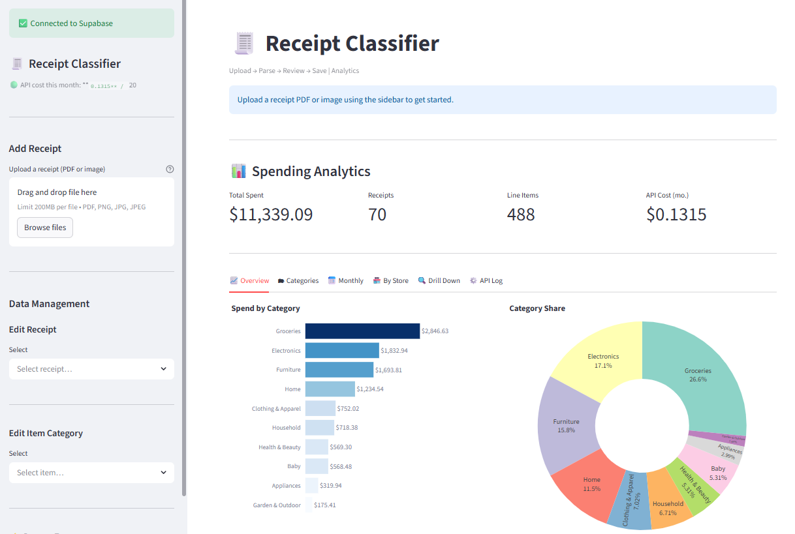

# 🧾 AI-Powered Receipt Classifier and Spending Tracker


An end-to-end Python application using **Streamlit** for the frontend, **OpenAI (GPT-4o-mini)** for receipt parsing and item classification, and **SQLAlchemy/SQLite** for robust data persistence. This tool automates the tedious process of entering purchase data, learns your preferred categories, and provides real-time spending analytics.

## Application Overeiw 




## 🚀 Key Features

- **Unstructured Data Ingestion (ETL):** Extracts text from Costco PDF receipts using `pdfplumber`.
- **AI-Powered Extraction & Classification:** Uses `gpt-4o-mini` to reliably parse receipt text, extract items, prices, and categorize each item into one of 10+ spending categories.
- **Data Quality & Memory:** Implements a user-defined feedback loop (category memory) to override and store category assignments for recurring items, ensuring data consistency over time.
- **Persistent Data Store:** Uses **SQLAlchemy** to define a clean relational schema and persists all data in a local SQLite database.
- **Interactive Dashboard:** Presents real-time spending analytics, including:
    - Total spending over time.
    - Category breakdown (using Plotly pie charts and bar charts).
    - Monthly spending trends.
- **Data Management UI:** Provides a dedicated sidebar interface for non-technical users to edit receipt metadata and recategorize historical items.


## 🧱 Architecture Overview

The application follows an event-driven data pipeline:
1.  **Ingestion:** User uploads a PDF via the Streamlit UI.
2.  **Extraction:** `pdfplumber` extracts raw text.
3.  **Transformation (NLP/ML):** The raw text is passed to GPT-4o-mini with specific prompts to ensure structured JSON output, which is then refined by the user-defined category memory layer.
4.  **Loading:** Structured data is mapped to the `Receipt` and `ReceiptItem` SQLAlchemy models and stored in `receipts.db`.
5.  **Presentation:** The Streamlit dashboard queries `receipts.db` to generate dynamic visualizations and a data management interface.

## ⚙️ Setup and Installation

### Prerequisites

- Python 3.9+
- An OpenAI API Key

### Steps

1.  **Clone the repository:**
    ```bash
    git clone https://github.com/s3achan/ai-receipt-tracker.git
    cd ai-receipt-tracker
    ```

2.  **Create and activate a virtual environment:**
    ```bash
    python -m venv venv
    source venv/bin/activate  # On Windows, use: venv\Scripts\activate
    ```

3.  **Install dependencies:**
    ```bash
    pip install -r requirements.txt
    ```

4.  **Configure Environment Variables:**
    Create a file named `.env` in the root directory and add your OpenAI API key:
    ```
    # .env
    OPENAI_API_KEY="sk-YOUR_API_KEY_HERE"
    ```
    *(Refer to the included `.env.example` file for structure.)*

5.  **Run the application:**
    ```bash
    streamlit run app.py
    ```

The application will open in your web browser at `http://localhost:8501`.

## 🛠️ Technologies Used

- **Python**
- **Streamlit** (Frontend/UI)
- **OpenAI API** (LLM/Classification)
- **SQLAlchemy** (ORM)
- **SQLite** (Database)
- **Pandas** (Data Manipulation)
- **Plotly Express** (Visualization)
- **pdfplumber** (PDF Extraction)


